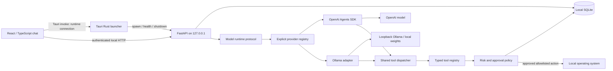

# Architecture

## Boundaries

The native launcher owns the Core process. It generates an ephemeral bearer token, passes it to the child through its environment, and returns the connection information to the UI through a narrowly scoped native command. The UI holds the token in memory. Core listens only on loopback, on port 42800 by default.

Core is a Python package with separate API, schemas, storage, orchestration, provider runtime, tools, permissions, and configuration responsibilities. The OpenAI Agents SDK is the initial runtime adapter, not a dependency of the desktop or persistence contract. The runtime protocol allows deterministic tests and replaceable providers; the local adapter shares orchestration, permissions and storage with the SDK adapter.

## Data and conversation

SQLite owns sessions, ordered messages, settings, approvals, and audit events. Conversation context is reconstructed from persisted messages for each turn; SDK in-memory state is not the durable source of truth. Timestamps are explicit and machine readable. UI rendering treats transcript text as text, not executable markup.

A turn validates and records the user message, supplies prior context to the model runtime, dispatches requested tools through the registry, and records the assistant response. A per-session concurrency guard prevents overlapping turns from scrambling context. Provider failures are reported explicitly and audited without exposing credentials or raw provider diagnostics.

The registry advertises tool definitions with typed schemas and permission/risk metadata. It rejects unknown tools and malformed arguments before considering execution. Local time is low risk and can execute without approval unless the user enables low-risk approval. Application launch is medium risk and always requires approval.

## Durable approval flow

1. A model tool call passes schema and allowlist validation.
2. Policy either authorizes immediate execution or persists a pending approval.
3. The tool returns a structured approval-required result to the current agent turn. The UI displays pending approvals separately from the model's prose.
4. A user decision calls the approval API. Core atomically claims the persisted request before executing it.
5. The decision, execution outcome, error if any, and a tool message are persisted and displayed in the transcript/approval card/audit. Historical tool messages are excluded from future inference context for both providers. Assistant content from turns containing a tool record is replaced with a fixed, result-free historical marker. Raw outcomes lack the corresponding assistant tool-call event; paraphrased replies also must not serve as evidence of current time or completion of a new action. The marker preserves turn structure so old requests do not appear unanswered. User messages and ordinary conversation replies remain. Inside an active model/tool loop, the adapter still delivers each result immediately with its proper tool-call association.

An approval does not hold a long-running HTTP/model request open. Pending approvals remain reviewable after restart. Already claimed requests cannot be replayed. A process crash around an external action cannot give an absolute exactly-once guarantee; recovery must avoid automatic retry when the outcome is uncertain.

## Desktop lifecycle and packaging

Development uses the repository's Core virtual environment and Vite. A packaged desktop uses a PyInstaller `--onedir` Core distribution bundled as a Tauri resource at `binaries/kat-core/`. The executable is a fixed resource selected by native code; the webview cannot select programs to run. Core startup is gated on an authenticated health response. A startup failure opens the connection/error screen with an explicit restart control. Closing the desktop shuts down its child. On Windows, a kernel Job Object also terminates Core when the desktop crashes; Core starts suspended and enters the Job Object before its main thread resumes, so Python launcher descendants cannot escape. Only approved user applications explicitly request breakaway and remain open. Linux development uses a parent-death signal with a dedicated creator thread, so a retiring restart worker cannot inadvertently kill Core.

No server process should be assumed to survive a cloud environment snapshot. A standalone Core can be launched for API development using its CLI and a private token file. Browser development supplies that token at runtime through the connection screen; tokens are never compiled into frontend assets.

## API outline

Every endpoint requires `Authorization: Bearer <runtime-token>`, including health.

| Resource | Operations | Responsibility |
| --- | --- | --- |
| `/health` | GET | Service version and provider configuration status |
| `/sessions` | GET, POST | List and create sessions |
| `/sessions/{id}/messages` | GET, POST | Persisted transcript and agent turns |
| `/approvals` | GET | Pending and completed tool requests |
| `/approvals/{id}/decision` | POST | Allow/deny with durable execution claim |
| `/settings` | GET, PUT | Model/provider and low-risk permission preference |
| `/audit` | GET | Bounded tool and application event history |
| `/providers` | GET | Implemented adapter capability descriptors |
| `/providers/probe` | POST | Nonsecret local discovery/status or OpenAI configuration presence |

FastAPI's OpenAPI schema is the authoritative field-level API reference, available with local authentication. React uses typed API models. Version future breaking changes deliberately rather than relying on UI assumptions.

Windows native startup resolves provider credentials before starting the owned
Core. Native Settings commands enter, replace or remove the current user's KAT
vault entry and restart Core; the UI receives status and a fresh Core connection.
The existing suspended-spawn Job Object boundary remains intact. NSIS installs
for the current user and bundles the full PyInstaller Core directory. Uninstall
removes application files and retains `%LOCALAPPDATA%\com.kat.assistant` and the
credential entry, allowing reinstall to recover the workspace. Remove the key
through Settings before uninstall if desired; data deletion is an explicit owner
operation. The installer never installs or downloads model weights.

`VERSION` is the release metadata source. Run `python scripts/version.py` after
changing it; Python/npm/Cargo/Tauri manifests and lockfiles carry generated copies
for their tooling. CI runs `python scripts/version.py --check` to prevent drift.
Only green, validated source commits may receive release tags.

ProviderRegistry resolves an explicit persisted provider to a ModelRuntime.
SelectedRuntime takes a settings snapshot per conversation request; providers
share the same context builder and tool dispatcher. The OpenAI SDK stays inside
its adapter. Ollama uses bounded native `/api/chat` JSON and `/api/show` capability
metadata. Authenticated provider discovery/probe routes expose safe status,
available model names and current tool support, never secret values. A configured
local route can still fail connectivity; Settings probes distinguish a stopped
backend from an uninstalled model. Schema migration 2 adds its nonsecret endpoint
while preserving provider/model/history/permissions and backing up version 1.

## Explicit memory / working context (0.3)

Migration 3 adds projects, structured memory items, immutable revision snapshots,
usage links and external-content SQLite FTS5. Sessions store an optional stable
project ID. Existing data upgrades through the same backed-up atomic migration.
`memory_schemas`, `memory_store`, `memory_retrieval` and `memory_api` separate
contracts, ownership, retrieval and HTTP concerns; the shared conversation service
chooses memory eligibility before transport. Memory is not Ollama-owned storage.

For each enabled local user turn, retrieve once from confirmed/current/unexpired
records, personal plus the active project. Future-effective, superseded, disputed
and wrong-project records are excluded. Tokenize at most 12 meaningful query words,
quote them as literal FTS terms and read at most 50 ranked candidates. Migration 4
replaces the derived index with `porter unicode61` and rebuilds it from unchanged
items. `memory_lexical` uses SQLite FTS5/fts5vocab in a separate RAM-only database
to apply that exact tokenizer to query and bounded candidate wording. The scorer
requires two distinct matching stems (one for a single-stem query), with at least
25% query coverage. A small general low-information vocabulary makes generic-only
queries abstain; those words can still contribute alongside meaningful evidence.
Raw sanitized terms go into FTS, avoiding a second application of Porter stemming.
Pins and importance rank eligible results; they never force relevance. Insert
at most four complete records within a 4,000-character serialized JSON budget.
There are no embeddings, quotas filled with weak results or full-table Python reads.

The normalization probe holds one input at a time and closes after retrieval;
no private normalized terms are cached or added to persistent storage. Safe
diagnostics expose counts, relevance/budget rejection counts, selected ID/revision
pairs and duration, never query terms, private wording or rejected record IDs.
Porter is English lexical normalization, not semantic understanding. Literal
Unicode, SQLite case/diacritic normalization and conservative overlap remain;
synonyms, irregular forms and stem collisions have explicit regression coverage
and limits in MEMORY_IMPLEMENTATION.md. Neither the provider/tool loop nor the
historical transient-tool context policy changes.

`working_context` marks the bounded JSON as UNTRUSTED DATA in a separate user-role
data envelope immediately before the latest owner request, outside system
instructions. One snapshot stays in the active loop; live tool responses retain
their proper associations. OpenAI does not retrieve and its adapter independently
ignores any memory argument. Provider failures never switch routes. Memory context
is not persisted as a chat/tool message or fed to future cloud requests. Replies
are ordinary transcript data and may themselves mention remembered information.

Usage stores IDs, inserted revision, session, assistant message, local provider
and timestamp, committed atomically with the assistant reply. Inspection resolves
that revision, so an edit never rewrites prior
evidence; after Forget it shows an identifier-only forgotten marker. Provenance
stores source IDs/role, never copied source text. Missing sources are unavailable.
The UI offers a separate Memory workspace, review forms and response inspectors.

Authenticated endpoints add `/projects` (GET/POST), `/sessions/{id}/scope` (PUT),
`/memory/settings` (PUT), `/memories` (GET/POST with bounded search/filter/pagination),
`/memories/{id}` (GET/PUT), `/{id}/status`, `/{id}/supersede`, `/{id}/forget` (POST),
`/{id}/revisions`, `/{id}/usage` and `/sessions/{id}/memory-usage` (GET). All retain
Core's global bearer authentication. `MemoryStore.rebuild()` reconstructs FTS from
authoritative current records; test recovery before restoring a database.
