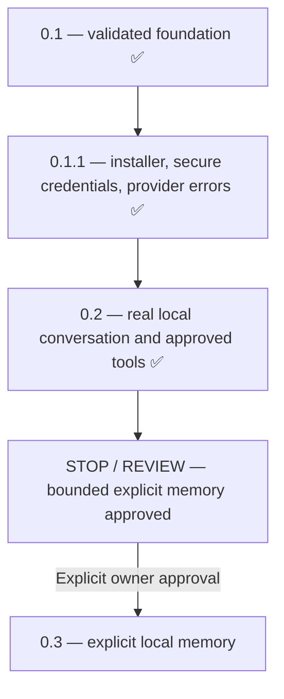

# Roadmap

The owner-approved sequence is **0.1 → 0.1.1 → 0.2 → STOP / REVIEW → 0.3+**.
The owner approved bounded explicit memory for 0.3; automatic extraction and autonomy remain deferred. This document separates
completed capabilities from proposals; later work requires new product decisions.

## 0.1: Foundation — complete

Persistent text sessions, authenticated local Core, Windows desktop, typed tool
registry, approvals and audit are implemented and Windows validated. The owner
reports live OpenAI conversation, time, Notepad approval, errors and persistence.
Agent-run SDK protocol tests remain distinct from that owner-reported evidence.

## 0.1.1: Installed Windows application — complete

Published [v0.1.1](https://github.com/Google-Stein/KAT/releases/tag/v0.1.1) includes
an NSIS installer and SHA-256 checksums. Normal launch needs no developer terminal,
Python or Rust. Native masked key entry, current-user Windows Credential Manager,
add/replace/remove/status, fresh authenticated Core restarts and safe provider
error classification are implemented. Keys never enter React or SQLite.

Actual Windows CI exercised current-user installation into a path with spaces,
GUI/authentication, normal/forced shutdown, persistence and data-preserving
uninstall. Separate production accessibility tests exercised native key input,
cancellation, replacement, restart persistence and removal. Signing, automatic
updates and interactive upgrade UX remain future hardening.

## 0.2: Local AI runtime — complete

An Ollama adapter and explicit provider registry share conversation/storage,
validated tools, approvals and audit with the OpenAI SDK adapter. Settings exposes
loopback-only address, local model discovery, readiness and tool capability.
OpenAI remains optional; failed local inference never falls back to cloud.
Cloud-backed Ollama aliases are rejected before conversation context is sent.

Actual Windows CPU inference used checksum-verified Ollama 0.40.1 and Qwen3:1.7b.
The installed UI generated a greeting, invoked the time tool, requested Notepad,
accepted owner-style approval, opened a real Notepad window and retained local
routing/history across relaunch. Notepad survived normal KAT close. All practical
Core/frontend/native/Windows release gates passed; exact runs, counts and commands
are in [VALIDATION.md](VALIDATION.md).

Backend installation and weights are explicit, separate downloads. Qwen3:8b is
the configurable starting recommendation for the owner's RTX 4090/24 GB VRAM;
that GPU's performance has not been measured by CPU CI. Ollama owns its server and
GPU lifecycle. No semantic memory, background extraction or automatic routing is
included. Small final UI work makes the release version and local/cloud route
visible in chat.

## STOP / REVIEW: Memory architecture — approved for bounded 0.3

The owner's 0.3 directive approves explicit creation, personal/project scopes,
local-only FTS5 retrieval off by default, provenance, revisions, supersession,
inspection and forgetting. Cloud transcript handling and backup erasure remain
separate. [MEMORY_DESIGN_PROPOSAL.md](MEMORY_DESIGN_PROPOSAL.md) distinguishes this
approved implementation from future ideas.

## 0.3: Persistent explicit memory — complete

The bounded implementation adds reviewed Add/Remember, editable records and
revisions, stable project scopes, lexical retrieval, response usage inspectors,
where-used/source links and removal of current/revision/search wording.
SQLite is not encrypted by KAT. Identifiable credentials and non-normal sensitivity
categories are refused; highly sensitive storage is unsupported.
Release requires green exact-source Core/Desktop/Windows and actual installed
Ollama create/restart/use/edit/forget validation; evidence is in VALIDATION.md.

## 0.3.1: Memory retrieval quality hotfix

Owner testing exposed a name/named mismatch across conversations. Shared SQLite
Porter normalization improves ordinary morphological matching in both indexed
search and relevance scoring. Existing data upgrades without wording changes;
scope, abstention, local-only context, Forget and tool authorization stay bounded.
Release requires the original gates plus installed real-Ollama name recall after
restart, a second new-conversation wording and unrelated-weather abstention.
No embeddings, automatic extraction or planning are part of this hotfix.
The full installed Windows sequence passed; exact results and release gating
are recorded in [VALIDATION.md](VALIDATION.md).

## Next bounded milestone — owner review

Gather real-world memory relevance/abstention and scope feedback, then improve
explicit memory UX and recovery ergonomics within the existing privacy boundary.
No automatic extraction, suggestions, embeddings, conflict resolution, planning
or autonomy is authorized by this release. Those require a new design decision.

## Later product direction — deferred

Conversation UX and richer bounded tools, projects/planning, connected services,
scheduling/proactivity, voice, multimodal/computer control and home integration
are separate milestones. This roadmap does not authorize arbitrary shell access,
LAN exposure or autonomous action. Each capability needs its own scope, security
model and measurable acceptance gate.
