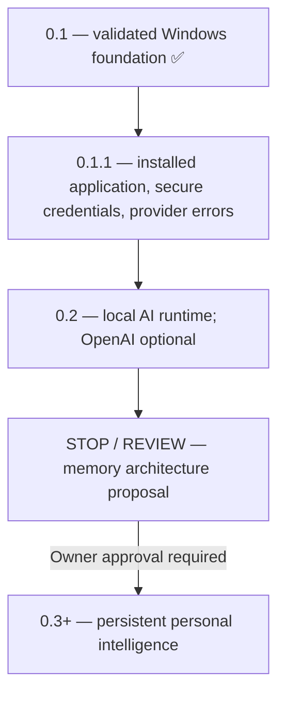

# Roadmap

The owner-approved sequence is **0.1 → 0.1.1 → 0.2 → STOP / REVIEW → 0.3+**. Complete and validate each release before moving to the next. This roadmap records product direction; future capabilities are not claims about the current implementation.

## 0.1: Foundation — complete

Persistent text sessions, authenticated local Core, a Windows desktop, a typed tool registry, risk/approval policy and audit records are implemented. Core, frontend and Windows CI passed, including packaged window creation, owned Core authentication and normal/forced shutdown cleanup. See [VALIDATION.md](VALIDATION.md) for actual results and limits. Installed-application validation and live provider-account validation belong to subsequent work.

## 0.1.1: Real installed application — next

Deliver an application the owner can install and use without a development checkout or installed Python, Node.js or Rust toolchains.

- Build and exercise the Windows installer: installation, installed-path launch, WebView2 prerequisites, normal/forced shutdown, upgrade and uninstall behavior. Preserve existing user data and define uninstall retention explicitly.
- Add secure provider-key entry, replacement and removal backed by Windows Credential Manager. Keep secrets out of source, SQLite, browser storage and logs; return configuration status rather than stored credentials to the renderer.
- Improve provider errors for invalid credentials, unavailable models, quota/rate limits, connectivity and timeouts. Show actionable recovery while keeping raw secret-bearing diagnostics out of the UI and audit log.

Acceptance requires green Core/frontend/native checks and real Windows installer/lifecycle validation. Credential tests must cover persistence across restart, replacement/removal and secret redaction. Provider-error tests must exercise the SDK adapter and API/UI behavior; simulated responses must be distinguished from live account validation. Document installation, configuration, troubleshooting and validation evidence.

The locally preserved credential-management work is a starting point for review and integration, not a completed or published 0.1.1 feature. Reassess it against the stabilized launcher before reuse.

## 0.2: Local AI runtime; OpenAI optional

Add a local inference adapter behind the existing model-runtime abstraction. Local conversation must work without an OpenAI key and, once its runtime/model are installed, without cloud inference. Retain OpenAI as an explicitly selected optional provider. Do not silently send a local-provider conversation to a cloud service when local inference fails.

Select the local engine and model based on Windows compatibility, hardware requirements, resource usage, licensing, conversation quality and validated tool-call behavior. Document model download consent, artifact verification, installation, provider selection and any separately owned runtime's lifecycle. Preserve authenticated Core access, durable sessions, argument validation, approvals and audit records across providers.

Acceptance requires real local-model conversation on documented Windows hardware, restart persistence, provider switching, clear resource/startup failures and equivalent tool/permission safeguards. Mock adapter tests supplement actual local inference validation. This release does not introduce a separate personal memory system.

## STOP / REVIEW: Memory architecture proposal

After 0.2, stop implementation of persistent personal intelligence and submit a memory architecture proposal to the owner. Do not begin memory infrastructure, ingestion, embeddings, retrieval or consolidation before explicit approval.

The proposal must explain:

- What KAT remembers, why, and how this differs from saved conversation transcripts.
- User consent, visibility, correction, deletion, retention, backup and export.
- Provenance, uncertainty, retrieval quality, evaluation and handling of conflicting information.
- Local storage and model boundaries, privacy, prompt-injection risks and permission enforcement.
- Migration, resource costs, failure/recovery behavior and a bounded first implementation.

The owner decides whether to proceed, change the design or stop. A proposal's existence does not constitute approval.

## 0.3+: Persistent personal intelligence — gated

Implement only the memory scope approved at the review gate. Define measurable acceptance criteria and validate user control, retrieval behavior, privacy and recovery before expanding it. This direction does not authorize background autonomy, voice, scheduling, browser automation, arbitrary shell execution or connected services; those require separate product decisions.

## Deferred work

Streaming/cancellation, richer session management, additional application registrations and broader permission policies remain candidates for later prioritization. They do not displace the release sequence above or become prerequisites without an explicit scope decision.
