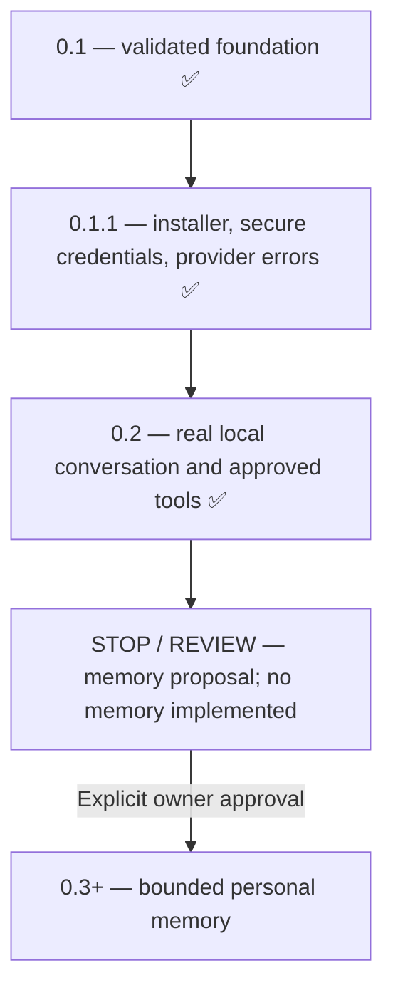

# Roadmap

The owner-approved sequence is **0.1 → 0.1.1 → 0.2 → STOP / REVIEW → 0.3+**.
Implementation is now at the deliberate memory review gate. This document separates
completed capabilities from proposals; later work requires new product decisions.

## 0.1: Foundation — complete

Persistent text sessions, authenticated local Core, Windows desktop, typed tool
registry, approvals and audit are implemented and Windows validated. The owner
reports live OpenAI conversation, time, Notepad approval, errors and persistence.
Agent-run SDK protocol tests remain distinct from that owner-reported evidence.

## 0.1.1: Installed Windows application — complete

Published [v0.1.1](https://github.com/Google-Stein/KAT/releases/tag/v0.1.1) includes
an NSIS installer and SHA-256 checksums. Normal launch needs no developer terminal,
Python or Rust. Native masked key entry, current-user Windows Credential Manager,
add/replace/remove/status, fresh authenticated Core restarts and safe provider
error classification are implemented. Keys never enter React or SQLite.

Actual Windows CI exercised current-user installation into a path with spaces,
GUI/authentication, normal/forced shutdown, persistence and data-preserving
uninstall. Separate production accessibility tests exercised native key input,
cancellation, replacement, restart persistence and removal. Signing, automatic
updates and interactive upgrade UX remain future hardening.

## 0.2: Local AI runtime — complete

An Ollama adapter and explicit provider registry share conversation/storage,
validated tools, approvals and audit with the OpenAI SDK adapter. Settings exposes
loopback-only address, local model discovery, readiness and tool capability.
OpenAI remains optional; failed local inference never falls back to cloud.
Cloud-backed Ollama aliases are rejected before conversation context is sent.

Actual Windows CPU inference used checksum-verified Ollama 0.40.1 and Qwen3:1.7b.
The installed UI generated a greeting, invoked the time tool, requested Notepad,
accepted owner-style approval, opened a real Notepad window and retained local
routing/history across relaunch. Notepad survived normal KAT close. All practical
Core/frontend/native/Windows release gates passed; exact runs, counts and commands
are in [VALIDATION.md](VALIDATION.md).

Backend installation and weights are explicit, separate downloads. Qwen3:8b is
the configurable starting recommendation for the owner's RTX 4090/24 GB VRAM;
that GPU's performance has not been measured by CPU CI. Ollama owns its server and
GPU lifecycle. No semantic memory, background extraction or automatic routing is
included. Small final UI work makes the release version and local/cloud route
visible in chat.

## STOP / REVIEW: Memory architecture proposal — current

Read [MEMORY_DESIGN_PROPOSAL.md](MEMORY_DESIGN_PROPOSAL.md). It recommends explicit,
owner-confirmed, scoped memory, inspect/edit/forget controls, provenance, safe
migrations and lexical retrieval before considering local embeddings. Memory is
excluded from cloud requests in the proposed first slice. No proposed tables,
retrieval pipeline, embedding model or consolidation code has been implemented.

The owner must approve or revise consent, scopes, cloud policy, erasure semantics
and sensitive-data policy before implementation. The proposal's existence is not
approval. Existing saved transcripts remain separate from semantic memory.

## After approval: three bounded milestones

1. Explicit remember/edit/forget, provenance and revisions, migration/recovery,
   inspection UI and clear transcript/backup erasure semantics.
2. Confirmed-only scoped lexical retrieval with a visible context inspector,
   abstention, injection tests and no cloud memory transmission.
3. Evaluate relevance, conflict/expiry handling and resource usage. Add a local
   embedding adapter only if measured lexical failures justify it and its model
   download is approved.

## Later product direction — deferred

Conversation UX and richer bounded tools, projects/planning, connected services,
scheduling/proactivity, voice, multimodal/computer control and home integration
are separate milestones. This roadmap does not authorize arbitrary shell access,
LAN exposure or autonomous action. Each capability needs its own scope, security
model and measurable acceptance gate.
